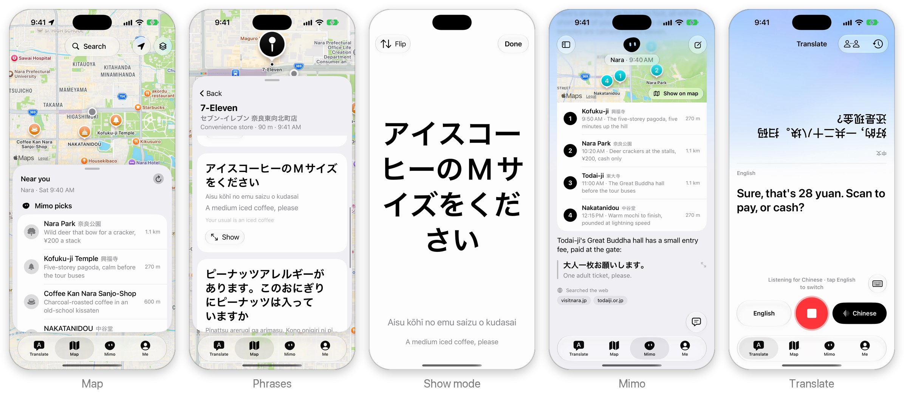
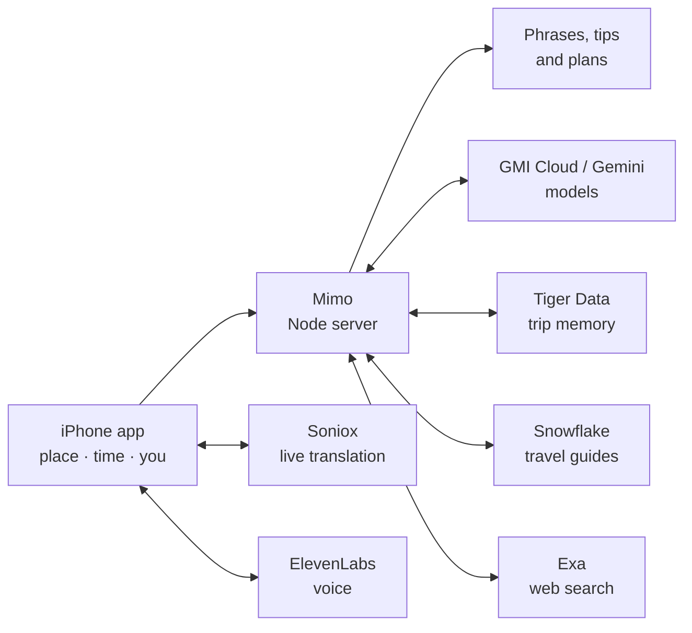

# Ryoko

  

  <strong>The right words in the local language, before you need them.</strong>

  <a href="#features">Features</a> ·
  <a href="#sponsor-tech">Sponsor tech</a> ·
  <a href="#how-it-works">How it works</a> ·
  <a href="resource/design.md">Design</a>

  
  
  
  

  
  
  
  

---

Ryoko is an iPhone travel app for Japan and China. It knows where you are, what time it is there and what you like, then hands you the phrase to say next in Japanese or Chinese, with a short reason it picked it.

**Mimo**, Ryoko's travel companion, finds places worth going to, plans a few hours and answers questions like a local friend would.

  

## Features

- **Phrases for where you are.** Open any place and get what to say there: local script, pronunciation, meaning, and why it fits you ("your usual is an iced coffee").
- **Show it or say it.** One tap puts a phrase full screen for the staff, flipped to face them. Or tap Speak and Ryoko says it out loud.
- **Mimo picks.** The map opens on places worth your time nearby, each with a one-line reason.
- **Ask Mimo anything.** "Plan my morning" or "how do I pay?" Mimo answers with stops on the map, phrases to use and the sources it checked.
- **Face-to-face translation.** Lay the phone flat between you. Each person speaks, and their half of the screen shows the translation facing them.
- **Allergy and taxi cards.** Explain a serious allergy, or show the driver where you're going, in the local language.
- **Remembers your trip.** Mimo recalls the places you've been, what you said there and what you've told it about yourself, even after a restart.
- **On your lock screen.** Your next phrase sits on the lock screen and in the Dynamic Island.
- **Look ahead.** Preview any place at any time before you go.

## Sponsor tech

| | What it does in Ryoko |
| --- | --- |
| **ElevenLabs** | Speak reads phrases aloud in a natural Japanese or Chinese voice, cached so repeats play instantly. |
| **Gemini API** | Turns every trip moment into an embedding so Mimo can find similar past moments. Gemini 3.8 Flash and 3.5 Flash-Lite are also in Mimo's model picker. |
| **Tiger Data** | Stores trip memory in a Postgres hypertable and saves Mimo chats. Mimo searches that memory mid-answer and saves what you tell it about yourself. |
| **Snowflake** | Holds Wikivoyage travel guides behind Cortex Search. Place tips quote them, and Mimo cites them with a link. |

Also built with **Soniox** (live speech translation), **GMI Cloud** (Mimo's default model), **Exa** (web search for hours, prices and events) and Apple's **MapKit**.

## How it works

Mimo names places and the phone finds them on Apple Maps, so every pin is a real place.

---

  Built solo at StormHack 2026 ·
  <a href="resource/design.md">Product and design</a> ·
  <a href="server/README.md">Server</a> ·
  <a href="THIRD_PARTY_NOTICES.md">Third-party notices</a>

