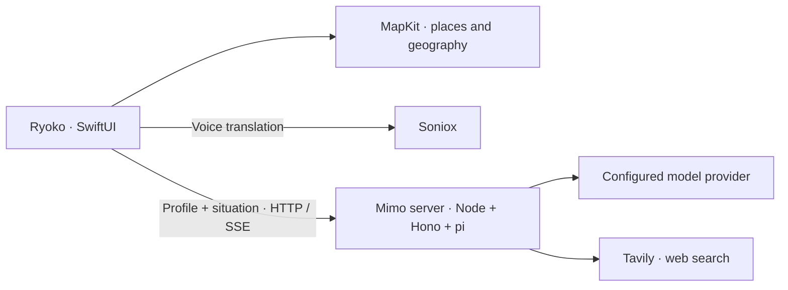

# Ryoko

**The right words, before you need them.**

A native iPhone travel companion being built for **StormHack 2026**. Ryoko brings your location, the local time, and your preferences together to help you know what to say in an unfamiliar place.

**Mimo** is the companion behind the experience: a calm local friend who prepares phrases, explains local customs, and helps you find your next stop.

[Product specification](resource/design.md) · [Build progress](resource/implementation-tracking.md) · [Contributor guide](AGENTS.md)

## The idea

You walk into a tea shop in Shanghai. The menu is unfamiliar, and someone is waiting for your order. Before you start typing into a translator, Ryoko is designed to give you a phrase that fits the moment and your tastes.

For someone who prefers less sweetness, that might be:

> 少糖，谢谢。
>
> *Shǎo táng, xièxie.*
>
> Less sugar, please.
>
> Because you like it less sweet.

Open the phrase as a large card to show the person at the counter. When they reply, move into two-way translation. Lay the phone between you so each person can read their language from their side.

The aim is to connect preparation and conversation, with the same context throughout.

## Project status

**This is an early hackathon prototype, not a finished app.** The repository currently includes the five-tab SwiftUI shell, Xcode project and Live Activity extension scaffold, configuration examples, and technical experiments. Feature screens are placeholders; the core app flows and agent server are still being implemented.

The experience described below is the build plan. See the [implementation tracker](resource/implementation-tracking.md) for current task status and the [design document](resource/design.md) for the source of truth.

## The experience we're building

| Feature | What it helps you do |
| --- | --- |
| **Now** | Get a few relevant phrases in local script, pronunciation guidance, a translation, and a short explanation of why each was suggested. |
| **Show** | Turn a phrase into a clear, full-screen card and flip it toward someone across a counter. |
| **Translate** | Have a two-way voice conversation, with each language facing its speaker when the phone is laid flat. |
| **Map** | Find places, open contextual phrase cards, and explore food, washrooms, and Mimo's suggestions. |
| **Mimo** | Ask questions, find nearby places, or plan a few hours. Suggested phrases open as Show cards, and resolved places appear on the map. |
| **Look ahead** | Preview a place and its local date and time, up to a week ahead, before you go. |
| **Allergy and taxi cards** | Communicate an allergy or show a destination's local name, address, and map. |

Mandarin in Simplified Chinese (`zh-Hans`) and Japanese (`ja`) are the first-class target languages. Other languages are best effort. The first build uses a bundled traveller profile; onboarding and profile editing follow in tier 2.

### What guides the design

- **Phrases come first.** The words you need are the most prominent content.
- **Personalisation is visible.** A short “because…” line points to actual profile or situation inputs.
- **The phone owns geography.** MapKit resolves place names; Mimo does not invent coordinates.
- **Preview is part of the product.** Preparing for a visit also makes it possible to demonstrate the experience from anywhere.
- **Native controls, readable content.** SwiftUI navigation, Dynamic Type, local-script typography, light and dark appearances, and restrained colour.

## Architecture and technology

The planned architecture separates place awareness, conversation translation, and contextual advice:



| Component | Technology and stage |
| --- | --- |
| iPhone app | Swift 6 and SwiftUI; project and placeholder shell present. Deployment target: iOS 26.1, iPhone, portrait. |
| Location and maps | CoreLocation and MapKit; app integration planned, with experiments in `spikes/`. |
| Voice translation | Soniox; planned core integration. CoreMotion will control the face-to-face layout. |
| Mimo server | Planned Node 24, Hono 4, and `@earendil-works/pi-agent-core` / `pi-ai`, both pinned to `1.0.1`. |
| Model provider | GMI Cloud is the initial planned provider, with model experiments in `spikes/gmi/`; the Gemini switch is scheduled for tier 2. |
| Web search | Tavily is planned for Mimo's sourced answers. |
| Streaming | HTTP and server-sent events; a standalone streaming experiment is in `spikes/sse/`. |

The device will own the profile and send it with requests. The first server version is planned to keep sessions in memory, with no user accounts. Durable trip memory is after-core work.

## Run the current iOS shell

### Requirements

- A Mac with Xcode and an iOS SDK supporting the iOS 26.1 deployment target and Swift 6.
- An installed compatible iPhone simulator, or an iPhone and a configured signing team for device builds.

Clone the repository and prepare the local configuration files:

```sh
git clone https://github.com/DanielOu1208/stormhack26.git
cd stormhack26
cp -n ios/Config/Local.example.xcconfig ios/Config/Local.xcconfig
cp -n ios/Config/Secrets.example.xcconfig ios/Config/Secrets.xcconfig
```

Open `ios/Ryoko.xcodeproj` in Xcode, select the **Ryoko** scheme and an installed iPhone simulator, then run. The current shell displays placeholder tabs; it does not require live service credentials.

For a command-line simulator build, choose a simulator installed on your Mac:

```sh
xcodebuild -project ios/Ryoko.xcodeproj -scheme Ryoko \
  -destination 'platform=iOS Simulator,name=iPhone 18 Pro' \
  -derivedDataPath ios/.build/DerivedData-readme build
```

For a physical-device build, set `DEVELOPMENT_TEAM` in `ios/Config/Local.xcconfig`. Each workstream should use its own DerivedData directory.

### Service configuration

`server/` currently contains an environment template, not a runnable application server. There is no server package manifest or start command yet. Node 24 and pnpm are planned requirements for that workstream.

To prepare its configuration:

```sh
cp -n server/.env.example server/.env
```

Once the integrations land, configure the following in the local files:

| Setting | Location and purpose |
| --- | --- |
| `DEVELOPMENT_TEAM` | `ios/Config/Local.xcconfig`; your Apple signing team. |
| `APP_TOKEN` | `server/.env` and `ios/Config/Secrets.xcconfig`; use the same random value on both sides. |
| `AGENT_BASE_URL` | `ios/Config/Secrets.xcconfig`; simulator server address or your device-accessible HTTPS endpoint. |
| `SONIOX_API_KEY` | The iOS secrets file for the initial speech client; the server environment for experiments and future short-lived key support. |
| `MODEL`, `GMI_API_KEY`, `GMI_MODEL`, `TAVILY_API_KEY` | `server/.env`; the initial model and search configuration. |

The planned local server address is `http://127.0.0.1:8792`. In an `.xcconfig` file, write it as `http:/$()/127.0.0.1:8792` because `//` begins a comment. A physical phone needs a reachable server endpoint; the development setup uses Tailscale Funnel. Keep its hostname out of the repository.

The planned `MODEL=faux` fixture mode will let app work proceed without model calls once the server and contracts are implemented.

## Repository guide

| Path | Contents |
| --- | --- |
| `ios/Ryoko/` | App entry point and feature folders. |
| `ios/Shared/` | Types shared by the app and widget extension. |
| `ios/RyokoLiveActivity/` | Live Activity extension scaffold. |
| `ios/Config/` | Build configuration and placeholder secrets templates. |
| `server/` | Environment template; future Mimo server. |
| `spikes/` | Isolated MapKit, model, and streaming experiments. |
| `resource/` | Product decisions, implementation tracking, and landing-page brief. |

`contracts/` is planned for shared schemas, example responses, language tables, and allergy templates. It has not been added yet.

## Roadmap

1. **Working core:** contextual phrases, Show cards, place preview, maps, voice translation, Mimo chat and discovery, and the agent server.
2. **Tier 2:** ElevenLabs speech, functional Live Activities, onboarding and profile editing, typed translation and corrections, the Gemini switch, and short-lived Soniox keys.
3. **After core:** Tiger Data sessions and trip memory, Snowflake-backed travel guides, menu scanning, offline place packs, and listen mode.

These are planned integrations, not claims of completed functionality. Detailed ownership and progress live in the [tracker](resource/implementation-tracking.md).

## Contributing

Read [AGENTS.md](AGENTS.md) before making changes. Claim a task in the tracker and work on a `ws/<workstream>-<short-name>` branch. Respect folder ownership; only the integrator edits the Xcode project file.

Never commit credentials, `.env`, `Secrets.xcconfig`, `Local.xcconfig`, signing keys, or MapKit response dumps. Use placeholder values in examples and keep experimental output in the ignored `spikes/**/out/` directories.

Allergy cards are intended to help communicate an allergy, not verify that a dish is safe. The plan requires human review of Mandarin and Japanese templates and marks generated free-text wording as unreviewed.
